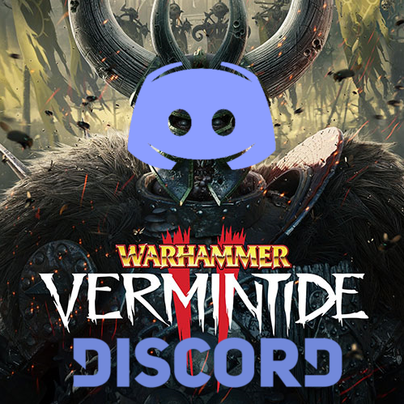

# Vermintide 2 - Discord Rich Presence
Discord Rich Vermintide is a Vermintide 2 mod that show on Discord the character you are playing, the map and the current party size.

It works using [Discord Rich](https://discordapp.com/rich-presence) library, thanks to Lua DiscordRPC.

### How to install the mod

Subscribe the mod on Steam, [it's in the Workshop](https://steamcommunity.com/sharedfiles/filedetails/?id=1406004015).

Make sure you have **already installed the Vermintide Mod Framework**, you can download it [here](https://steamcommunity.com/sharedfiles/filedetails/?id=1369573612). Check that it's the first mod loaded in the launcher.

Finally, install the [Discord Rich Library](https://github.com/ScrappyCocco/Vermintide-2---Discord-Rich-Presence/releases), you have to do this manually as mods cannot add external libraries to game files...

## Built Using

* [Vermintide Mod Framework](https://github.com/Vermintide-Mod-Framework) - To build the mod easly
* [Lua DiscordRPC](https://github.com/pfirsich/lua-discordRPC) - For using the Discord Library from Lua
* [Vermintide 2 Wiki](https://vermintide2.gamepedia.com/Vermintide_2_Wiki) - All the Rich Presence images are from there, so a special thanks to those guys

## Authors

* **ScrappyCocco** - *Mod creator*
* _Thanks to all the people of Vermintide Modders Discord server, you helped me a lot (Special thanks to Arkii and SkacikPL)_

## License

This project is licensed under the MIT License - see the [LICENSE](LICENSE) file for details
